# GD_Technician_Admin_Panel

DG Technician Admin is the admin application that is synced with the DG Technician application where all the technicians are allowed to register as technicians create their profiles and manage their complete profiles. Here Technicians are allowed to create profiles, select types of work like electricians, plumbers, handymen, painters, etc, and then select time slots for appointments like 1 hour, 2 hours.., 1 day, etc.

Here they are also allowed to manage their scheduled appointments, search them, chat with their clients to make more clarification, and view a complete dashboard to manage all of their work.

Where DG Technician is an application where users can find various technicians and hire them according to their own will.

<b>Application Overview</b>

<b>1) Splash Screen</b>

  

<b>2) Get Started</b>

  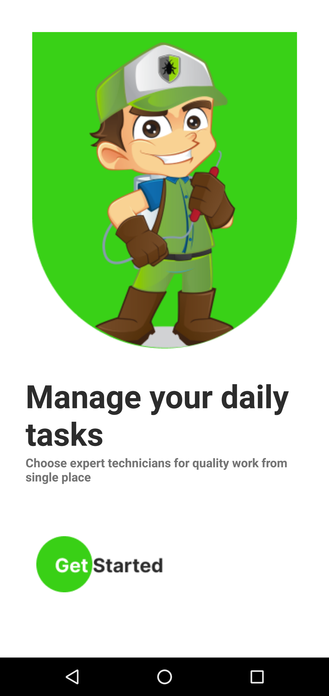

<b>3) LogIn Screen</b>

  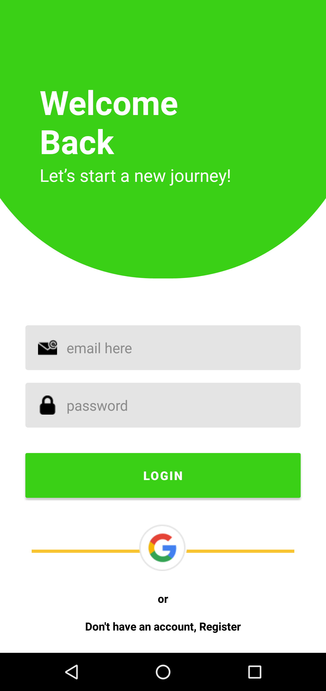

<b>4) SignUp Screen</b>

  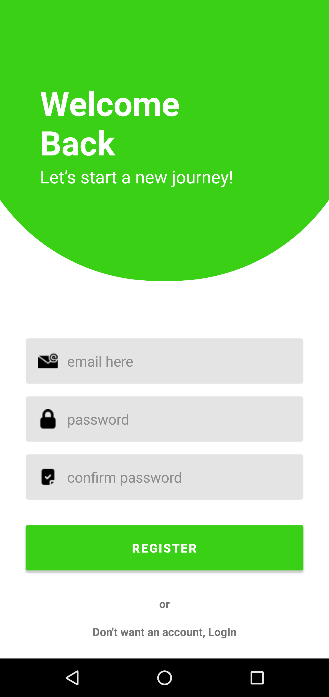

<b>5) OnBoard Screens</b>

  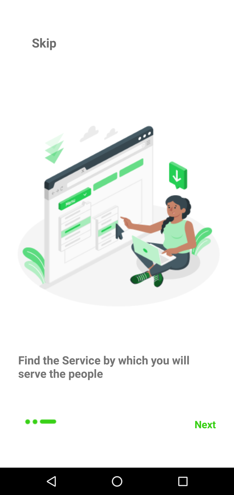

  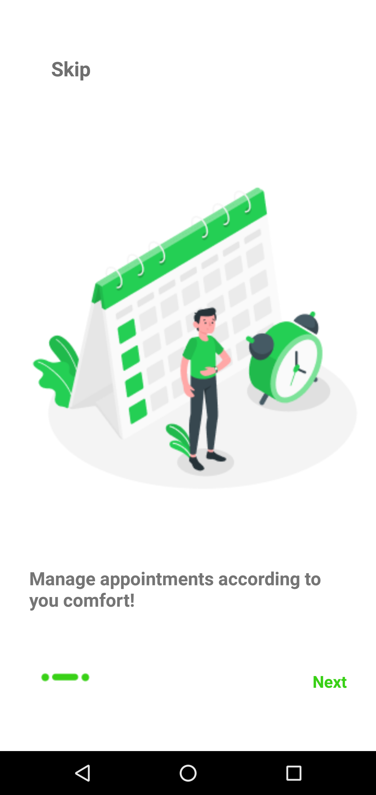

  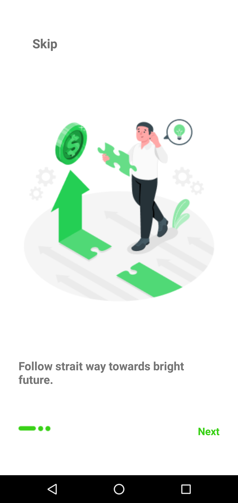

<b>6) Create Profile</b>

  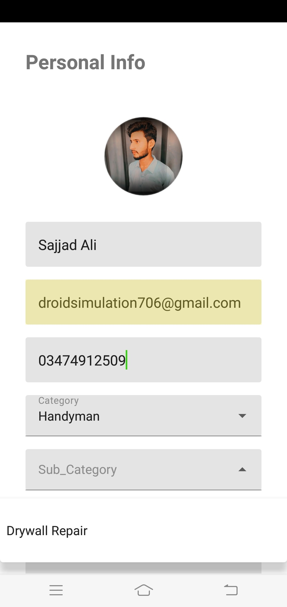

  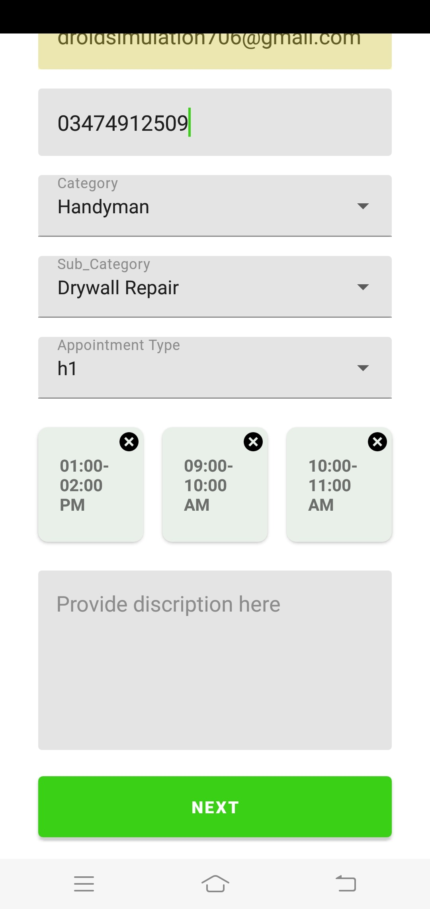

  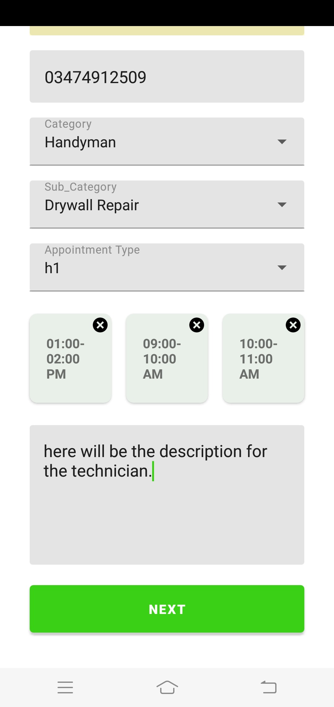

<b>7) Home Screen</b>

  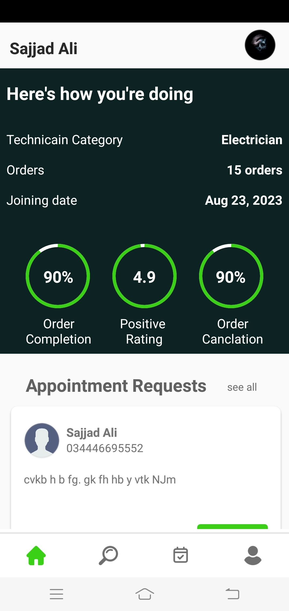

  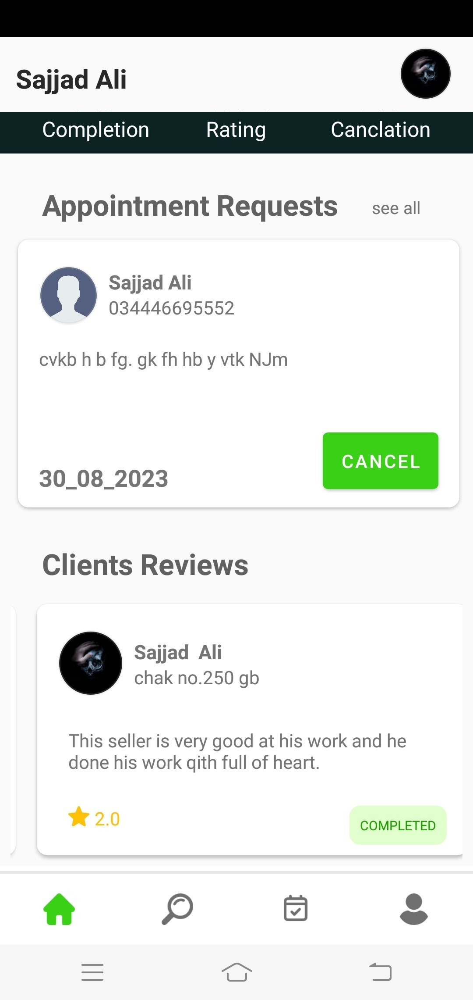

<b>8) Chat Screen</b>

  

<b>4) Profile Screen</b>

  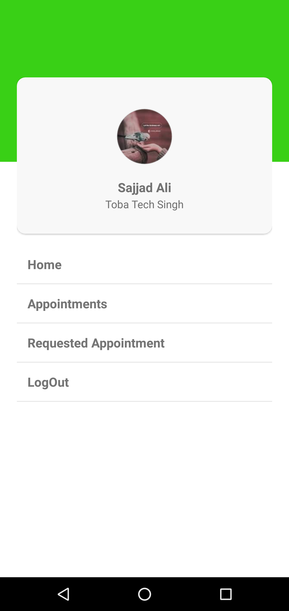

<b>4) Search Screen</b>

  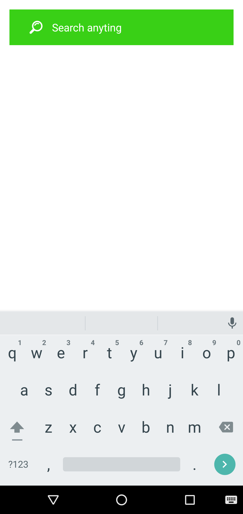

<b>Application Features:</b>

<ol>
  <li>Fragments(NavHost Fragments</li>
  <li>Navigation Graph</li>
  <li>Firebase Authentication</li>
  <li>Firebase Firestore & Realtime Datebase</li>
  <li>NVVM Architechture</li>
  <li>Glige Liabrary</li>
  <li>Attractive UI/UX</li>
</ol>
